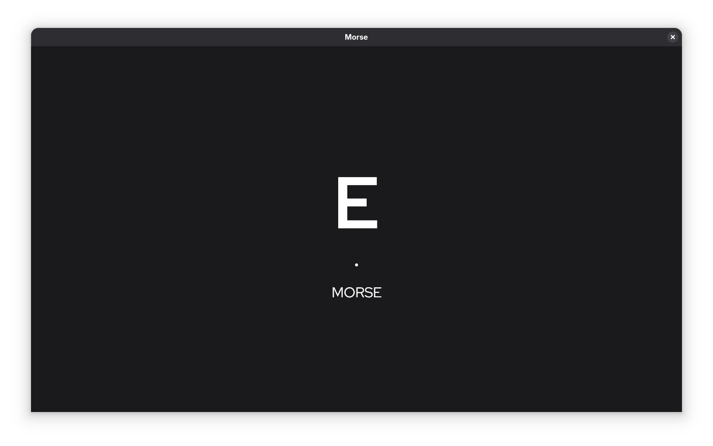

# Morse Game

This is a little game made in Bevy to learn Morse.
The controls are easy to use. You can either click with your left mouse button or press the 'Enter' key.
To clear the history, press the right mouse button or space bar on your keyboard.
To clear the last character in the history, press the backspace key.

